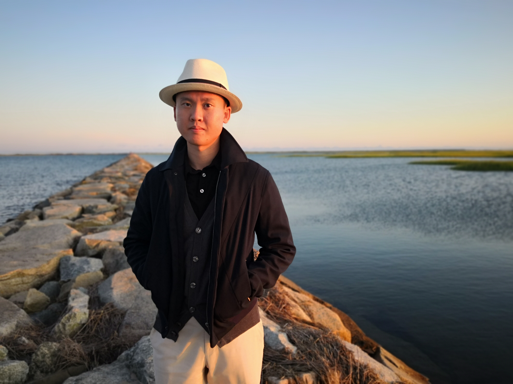

# 你好，很高兴认识你

&nbsp;&nbsp;&nbsp;&nbsp;&nbsp;&nbsp;&nbsp;&nbsp;&nbsp;&nbsp;&nbsp;&nbsp;&nbsp;&nbsp;&nbsp;&nbsp;&nbsp;&nbsp;&nbsp;

## 基本情况

92年， 属羊， 173/65, 目前互联网行业工程师, base杭州

在深圳长大的陕西汉中人

俄亥俄州立大学本科
加州大学圣地亚哥分校/佐治亚理工双硕士

名下深圳南山有房无贷

## 自我介绍

虽然给人的第一感是礼貌高冷, 但对人特别真诚, 生活中很接地气, 是很幽默的一个人. 性格方面属于助他服务性, 超级超级乐观, 对世界有极强的包容心. 关注时政, 财经金融, 社会科学, 一直坚持学习, 生活原则之一就是要跳出自己的舒适区.

头脑极度开放, 常年保持空杯心态, 拥有非常包容的世界观, 生活中更愿意感受他人的情感, 认为观察比思考更重要. 生活中自信且懂得时刻反思复盘自己, 会积极迎接会让自己痛苦的事决定而非消极逃避痛苦.

希望自己能和AI一样通过生活的反馈不断成为更好的自己. 对我而言, 更好的自己并不是你成为世俗意义上更优秀的人(更好收入,更高社会地位,etc,etc). 更好的自已对我意味着一颗强大而坚强的心: 除了人们常说情商, 智商, 财商. 我更关注的是自己的逆商. 希望再艰难的生活, 再困难的处境都不会把自己打倒. 希望通过更好的感受观察生活, 总结自己的感受, 保持极度开放的头脑, 积极迎接让自己痛苦的事情. 我的家庭大起大落过, 我也见识过其他起高楼又楼塌了的日子: 对事物我更希望能保持一种动态的眼光.

关于自己其他的背景: 在深圳长大并愉快的过了人生的头二十年后， 在美国读书工作将近八年, 毕业后从事数据科学咨询工作, 于今年年底回国做算法工程师. 一直有身材管理，精力管理的习惯. Active lifestyle, 喜欢运动来放松自己的压力， 除了日常健身， 普拉提， 网球，射箭和滑雪都是我喜欢的放松方式. 不烟不酒， 假期喜欢找个海边的fitness resort 运动看海享受美食.

喜欢做饭, 咖啡喝的特别特别凶. 2021年目标之一就是一天不能超过三杯咖啡. 喜欢用心和双眼感受世界, 希望能用自己的双脚丈量我们的祖国, 感受祖国的乡土人文, 壮美山河, 多变的地理风貌与可爱的人们.

懂得欣赏生活, 但更能理解他人的不易. 虽是理工科, 但是喜欢欣赏美, 喜欢逛艺术馆, 研究穿着搭配, 喜欢鲜花, 享受平时摆摆弄弄花.

三言两语描述了自己, 希望两个人能互相真诚认识了解对方, 相知, 相爱.

## 关于家庭

独子, 从小跟母亲生活, 母亲华南理工本科, 经商. 非常懂得生活, 开明温柔, 从小到达一直尊重我的决定, 从不干涉我的生活. 家境良好无负债.

## 关于感情

过去的7,8年里没有在同一个城市呆过超过两年, 学生时代和毕业后的的爱情都因为异地或者异国的原因没有持续下去.

## 希望你

爱国. 愿意长期在中国生活, 希望能在杭州或者深圳定居

热爱生活

头脑极度开放, 并且拥有非常开放和包容的世界观: 愿意互相取长补短,共同进步.

为人乐观, 热情, 喜欢幽默

乐于沟通, 善于沟通, 共情, 理解他人: 懂得两个人需要相互理解, 彼此包容扶持. 个性温暖, 懂得换位思考

良好的学习能力:快速理解, 认识新领域/知识的能力: 做事有条理讲究方法论

享受运动， 生活和谐

